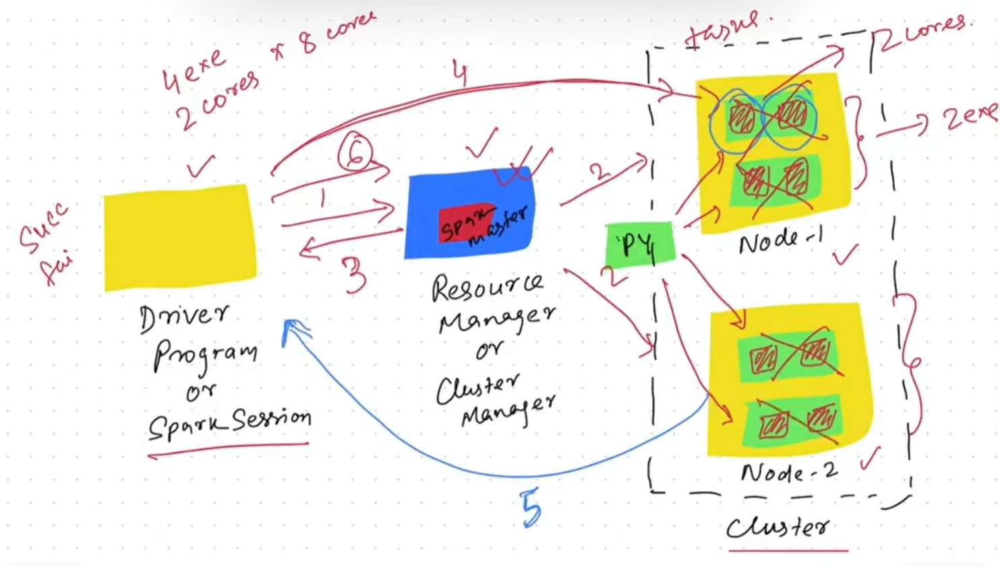
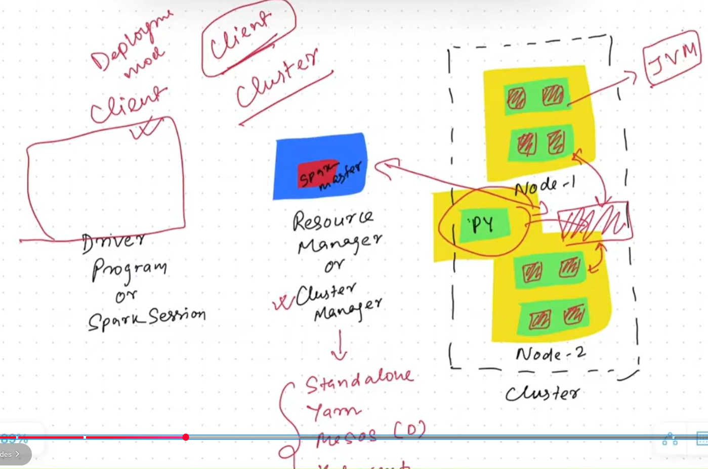
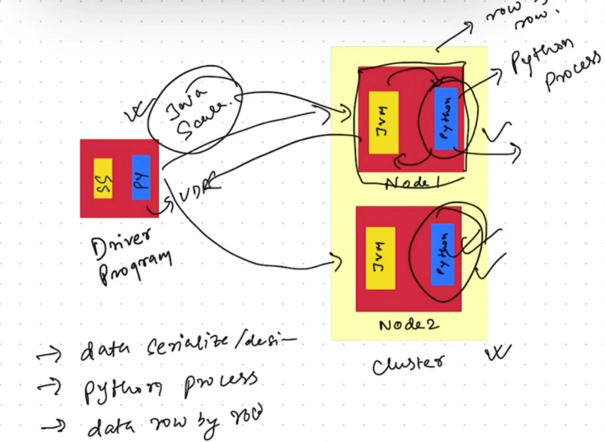

Basics of pyspark library is discussed and practiced in this repo. 
Spark is for big data and all data activities can be done on a distributed environment or on cluster of systems may be on cloud. 
pyspark - spark api with python 
Spark can run on Hadoop, Apache Mesos, Kubernetes, standalone or in the cloud. It can access diverse data sources. 
Databricks is the platform to run pyspark programs in a distributed env using the community login. 
Its an open and unified data analytics platofrm for data engineering, data science, machine learning and analytics. 
## PySpark Tutorial | PySpark Training | Learn from Basics to Advanced Performance Optimization
Spark is open source unified computing engine with set of libraries for parallel data processing on computer cluster. 
Spark is 100 times faster than traditional Hadoop Map reduce. 
spark uses RAM for data processing whereas traditional hadoop map redue uses disk to write data during processing 
low level api (rdd (resiliant distributed data) and distributed variables) -> structured api (dataframes datasets and sql) -> libraries and ecosystem (structured streaming and advanced analytics, graph query languages etc) 
## How Spark Works - Driver & Executors | How Spark divide Job in Stages | What is Shuffle in Spark
Driver, Executor, Shuffle, Local and Global stage 
Shuffle is the boundary which divide job into stages. 
Driver - Manitains and Manages the information and state of executors. Analyses distributes and schedules the work for executors 
Executors are JVM processes. Responds to driver with execution status. Cores of executors 
## Spark Transformations & Actions | Why Spark prefers Lazy Evaluation | What are Partitions in Spark
To allow every executors to work in parallel, Spark breaks down the data into chunks called partitions. 
Transformation: The instruction or code to modify and transform data is known as transformation. Eg select, where, groupBy etc
1. Narrow
2. Wide transformation

Wide transformation lead to shuffle. 
To trigger the execution we need to call an action. This executes the plan created by Transformation. 
3 types of actions:
1. View data in console
2. Collect data to native language
3. Write data to output data sources

Spark prefers lazy evaluation, It waits till the last moment to execute graph of computation. It waits untill an action is called. 
<b>Spark session</b>: The driver process is known as Spark Session, it is the entry point for a spark execution. The spark session instance executes the code in the cluster. For one spark application there can be only one spark session. 
## Spark DataFrames & Execution Plans | Spark Logical and Physical Execution Planning | What are DAG
Datafame is the most common structured API represented like a table. DF has a schema which is the metadata for the columns. Data in DFs are stored in partitions and DFs are immutable. Built on low level API such as RDD 
You can cascade more than one transformation command to collect data into another DF. 
DF in 4 data partitions -> transformation -> action is applied 
How spark work on planning for the structured APIs - Execution Plan Phases 
1. Logical Plan
2. Physical Plan

Code by user -> Unresolved logical plan -> Validated against a catalogue, col and table names are validated -> Resolved logical plan -> Taken into the catalyst optimizer -> generates a optimized logical plan 
mutiple physical plan based on cluster and physical configuration -> runs against a cost model -> Best Physical plan is selected and sent to cluster for execution -> Once executor recieves the best execution plan they run the physical plan against the data partitions. 
<b>Directed Acyclic Graph</b> 
<b>RDD: Resiliant distributed data</b> 
## Understand Spark Execution on Cluster | Cluster Manager | Cluster Deployment Modes | Spark Submit

Above is a single client spark env. 
Three types of resource managers or cluster managers: 
Standalone: Spark cluster 
Yarn: Hadoop cluster, yarn is the resource manager 
Kubernetes: Containerized environment 
Deployment modes: Client and Cluster 
Below is the cluster mode diag. 

UDF 
